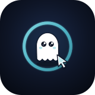
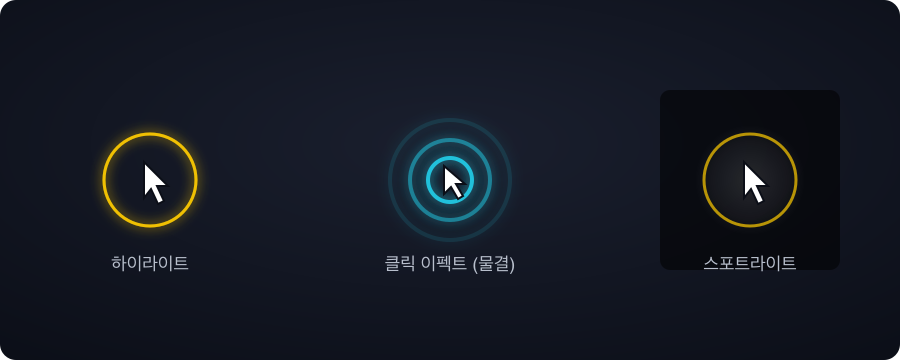
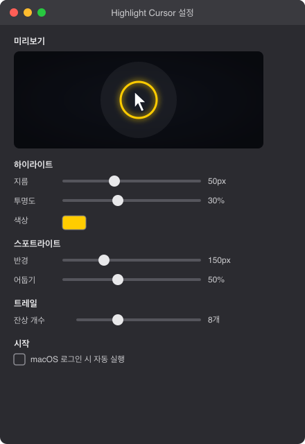

# Highlight Cursor 👻

<p align="center">
  
</p>

**화면 발표·강의·녹화에서 마우스 포인터가 잘 보이도록 커서에 시각 효과를 입히는 macOS 메뉴바 앱입니다.**

Swift + AppKit + Core Animation으로 처음부터 만들었고, 상시 표시되는 하이라이트 링은 GPU 애니메이션만 사용해 마우스가 멈추면 CPU 사용량이 0%에 수렴합니다.

## 무엇을 하나요

화면 어디서든 커서를 따라다니는 은은한 하이라이트 링과, 클릭할 때 터지는 화려한 이펙트, 그리고 필요할 때 켜는 스포트라이트·트레일까지 — 발표 중에 "지금 여기를 보세요"를 말 대신 시각적으로 전달합니다.

- 🟡 **커서 하이라이트** — 은은하게 숨 쉬는 펄스 애니메이션의 링이 커서를 항상 따라다닙니다.
- ✨ **클릭 이펙트** — 클릭할 때마다 4가지 스타일 중 고른 이펙트가 터집니다: 물결(ripple), 벚꽃(sakura), 기 폭발(energyBurst), 반짝임(sparkle). 좌클릭과 우클릭은 색으로 구분됩니다.
- 🔦 **스포트라이트** — 커서 주변 원만 밝게 두고 나머지 화면을 어둡게 덮어 시선을 집중시킵니다.
- 💫 **트레일** — 빠르게 움직일 때 짧은 잔상이 따라오다 사라집니다.
- ⚙️ **설정 창** — 색상·크기·투명도·반경·어둡기·잔상 개수를 슬라이더로 조정하고, 상단 미리보기 패널에서 조정 결과를 바로 확인합니다. macOS 로그인 시 자동 실행도 여기서 켤 수 있습니다.

모든 효과는 메뉴바 아이콘에서 개별적으로 켜고 끌 수 있고, 설정은 앱을 재시작해도 그대로 유지됩니다.

<p align="center">
  
</p>

## 리소스 최적화

이 앱을 만든 이유가 바로 이것입니다 — 비슷한 앱들이 화면을 상시 다시 그리며 CPU와 배터리를 많이 쓰는 문제를 피하는 것.

| 원칙 | 구현 |
|---|---|
| **폴링 없음** | `NSEvent` 전역 모니터가 마우스가 실제로 움직일 때만 콜백을 준다. 정지 시 콜백이 0번 발생한다. |
| **GPU 애니메이션만 사용** | 펄스·글로우·클릭 이펙트 전부 `CABasicAnimation`/`CAAnimationGroup`으로 GPU가 처리한다. CPU는 위치 갱신만 담당한다. |
| **효과별 렌더 최소화** | 위치 갱신은 `CATransaction.setDisableActions(true)`로 불필요한 암묵적 애니메이션을 끈다. |
| **스포트라이트 마스크** | 화면 전체를 다시 그리지 않고, 방사형 그라데이션 마스크의 중심 좌표만 이동시킨다. |
| **파티클 상한** | 클릭 이펙트·트레일 모두 동시 존재 개수에 상한을 두어(각 최대 48개, 트레일 최대 개수는 설정 가능) 클릭을 연타해도 무한 누적되지 않는다. |
| **꺼진 효과는 레이어 자체 제거** | 사용하지 않는 효과는 레이어를 창에서 완전히 떼어내 컴포지팅 비용을 0으로 만든다. |

**실측 결과**: 마우스 정지 상태에서 CPU 0.0%, 메모리 0.2% (활성 펄스 애니메이션이 도는 상태에서도).

## 빌드 & 실행

이 프로젝트는 **Xcode.app 없이** Command Line Tools + `swiftc` 직접 컴파일만으로 빌드됩니다.

### 사전 설치 및 점검

macOS 14+와 Swift 6이 필요합니다. 처음 빌드하는 Mac에서는 Apple Command Line Tools를 설치한 뒤, Swift 컴파일러가 정상 동작하는지 먼저 확인하세요.

```bash
xcode-select --install

# 설치가 끝난 뒤 새 터미널에서 실행
xcode-select -p
swift --version
```

> **참고 — SwiftPM `Undefined symbols` 에러**: macOS 26 + Swift 6.3 환경에서 `swift build`/`swift package describe`를 실행하면 `PackageDescription.Package.__allocating_init` 심볼을 찾지 못하는 링크 에러가 발생할 수 있습니다. 이것은 Command Line Tools 내부의 SwiftPM 바이너리와 `libPackageDescription.dylib` 간의 심볼 불일치(`SwiftVersion` vs `SwiftLanguageMode`)이며, 프로젝트 소스 문제가 아닙니다. 빌드 스크립트는 이 문제를 우회하기 위해 SwiftPM 대신 `swiftc`로 직접 컴파일합니다. Apple이 CLT 업데이트로 이 불일치를 해결하면 SwiftPM 빌드로 복귀할 수 있습니다.

```bash
git clone https://github.com/jesamkim/highlight-cursor.git
cd highlight-cursor
./scripts/build_app.sh   # swiftc 직접 빌드 -> .app 번들 조립 -> ad-hoc 코드서명
open HighlightCursor.app
```

첫 실행 시 macOS가 **손쉬운 사용(접근성)** 권한을 요청합니다. 시스템 설정 → 개인정보 보호 및 보안 → 손쉬운 사용에서 HighlightCursor를 켜주세요. 마우스 이동/클릭을 감지하려면 이 권한이 필요합니다.

앱은 메뉴바 액세서리로 실행되며 Dock 아이콘이 없습니다. **상단 메뉴바의 커서 아이콘**에서 모든 기능에 접근합니다.

## 사용법

메뉴바 아이콘을 클릭하면:
- 각 효과 켜기/끄기 (체크마크로 현재 상태 표시)
- 클릭 이펙트 스타일 선택 (물결 / 벚꽃 / 기 폭발 / 반짝임)
- **설정…** — 세부 값 조정 창 열기
- **종료**

<p align="center">
  
</p>

## 아키텍처

```
마우스 이벤트 (이동/클릭)
        │
   EventMonitor        ← NSEvent 전역 모니터 (폴링 없음)
        │
   EffectCoordinator    ← 화면별 좌표 변환 + 각 효과에 브로드캐스트
        │
        ├──▶ HighlightLayer    커서를 따라다니는 펄스 링
        ├──▶ SpotlightLayer    주변 어둡게 (방사형 그라데이션 마스크)
        ├──▶ TrailLayer        잔상 (개수 상한 큐)
        └──▶ ClickEffectLayer  클릭 시 일회성 이펙트 (4 스타일)
             │
             ▼
   OverlayWindow (화면별)  ← 투명·클릭통과 창, Core Animation 레이어를 얹음
```

전체 소스는 `Sources/HighlightCursorCore`(순수 로직: 설정, 좌표 변환, 색상 파싱)와 `Sources/HighlightCursor`(AppKit UI, 효과 레이어, 오버레이)로 나뉩니다.

## 테스트

이 환경(Command Line Tools만 설치, Xcode.app 없음)에는 XCTest와 swift-testing이 모두 없어서 `swift test`를 쓸 수 없습니다. 대신 의존성 없는 자체 테스트 셤(`TinyTest`)으로 순수 로직(설정 저장/로드, 좌표 변환, 색상 파싱, 클릭 스타일 하위호환성)을 검증합니다.

```bash
./scripts/test.sh   # 20개 체크, 실패 시 non-zero 종료
```

시각 효과(하이라이트·스포트라이트·클릭 이펙트)는 자동 테스트가 어려워 실제 앱 실행으로 확인합니다.

## 기술 스택

- **언어/프레임워크**: Swift 6, AppKit, Core Animation(QuartzCore), CoreGraphics
- **빌드**: `swiftc` 직접 컴파일 (SwiftPM 매니페스트는 참조용으로 유지, Xcode.app 불필요)
- **아키텍처**: 3-타깃 구조 — `HighlightCursorCore`(라이브러리), `HighlightCursor`(실행 앱), `HighlightCursorTests`(테스트 실행 파일)
- **배포**: 개인 사용 목적, ad-hoc 코드서명(App Store 배포 범위 밖)

## 만든이

**Jesam Kim** ([@jesamkim](https://github.com/jesamkim)) : 설계·구현 => 브레인스토밍부터 스펙·계획·구현·코드 리뷰까지 AWS AI 에이전트 **Kiro** 👻 와 함께 만들었습니다.

## 라이선스

[MIT License](LICENSE)
